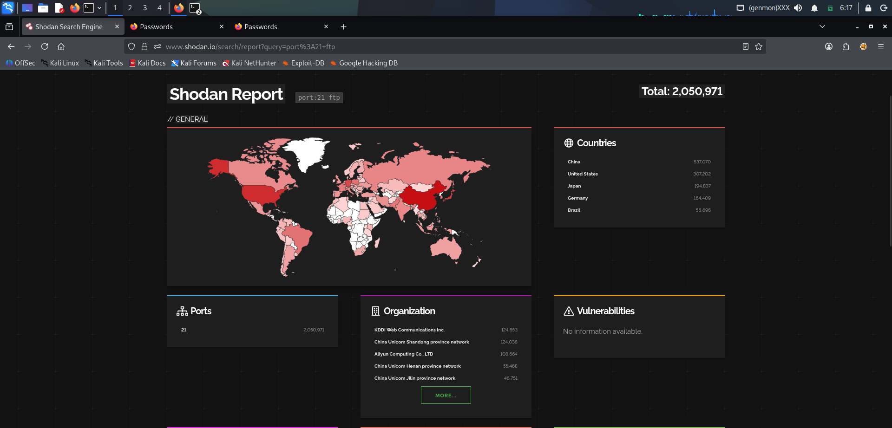
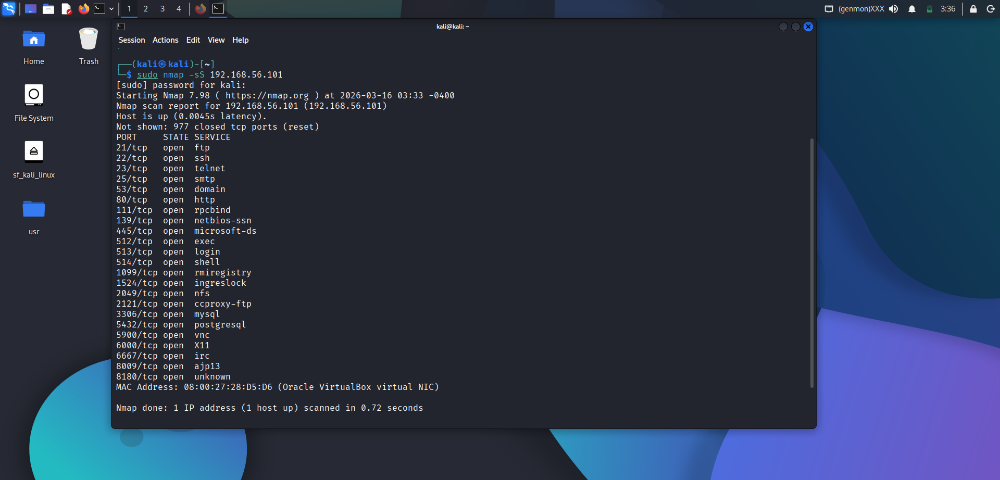
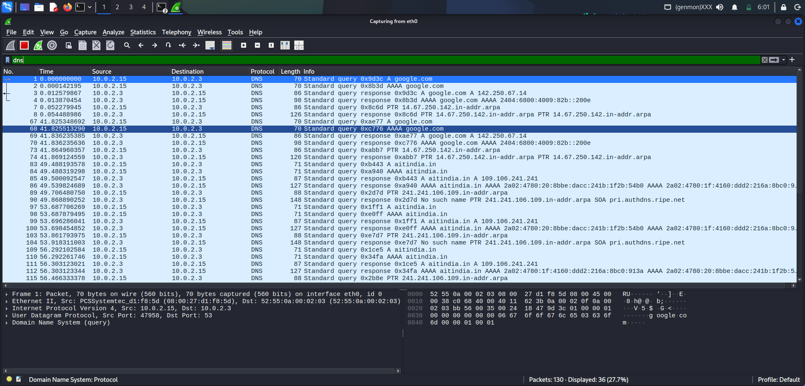
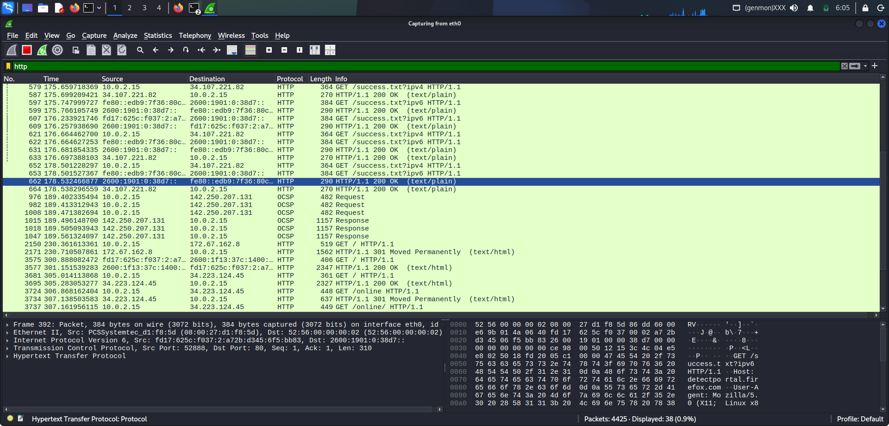
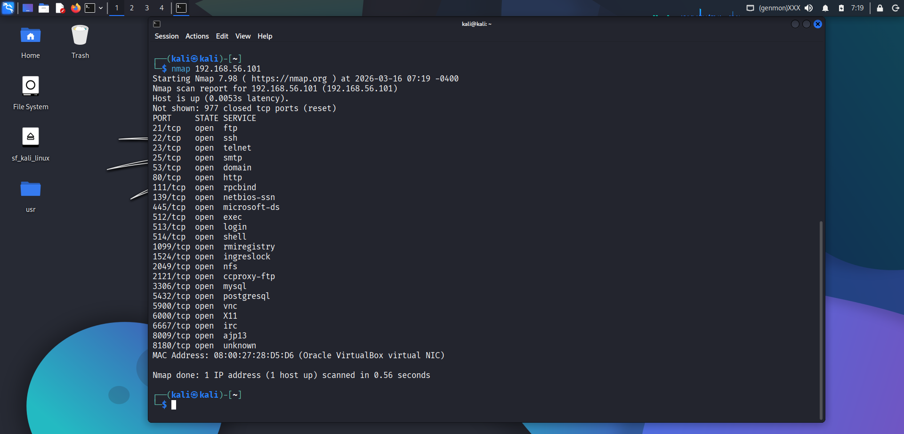
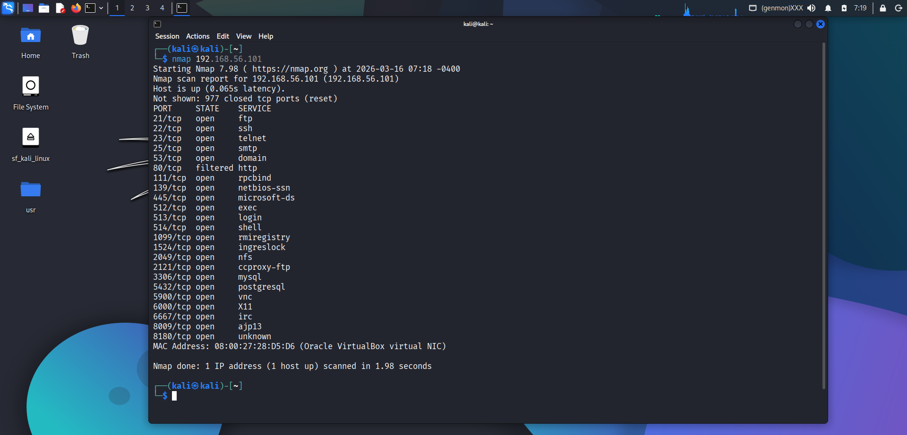

# Scan Analysis Report
## Cybersecurity Internship Task
**Date:** March 16, 2026
**Target:** Metasploitable 2 — 192.168.56.101
**Attacker Machine:** Kali Linux — 192.168.56.102

---

## 1. Reconnaissance Results

### 1.1 Network Interface Check
- Command:

      ip a
- Kali Linux IP on eth0: 192.168.56.102
- Kali Linux IP on eth1: 10.0.3.15
- Target confirmed reachable via ping test
- Ping response time: under 2 milliseconds

### 1.2 Nslookup Result
- Command:

      nslookup scanme.nmap.org
- Resolved IP: 45.33.32.156
- IPv6: 2600:3c01::f03c:91ff:fe18:bb2f

### 1.3 Google Dorking Result
- Query: `site:testphp.vulnweb.com login`
- Found: Login page exposed
- Found: Administrative panel exposed
- Found: PHP Version 5.1.6 exposed
- Risk: Outdated PHP version vulnerable to attacks

### 1.4 Shodan Result
- Query: `port:21 ftp`

- Total exposed devices: 2,050,971
- Top countries: China, United States, Japan, Germany, Brazil
- Risk: Millions of FTP services exposed on internet

---

## 2. Port Scanning Results

### 2.1 TCP SYN Scan
- Command:

      sudo nmap -sS 192.168.56.101
- Total open ports found: 23

### 2.2 Service Version Detection
- Command:

      sudo nmap -sV 192.168.56.101

| Port | Service | Version | Risk |
|---|---|---|---|
| 21/tcp | FTP | vsftpd 2.3.4 | Critical |
| 22/tcp | SSH | OpenSSH 4.7p1 | High |
| 23/tcp | Telnet | Linux telnetd | Critical |
| 25/tcp | SMTP | Postfix smtpd | Medium |
| 80/tcp | HTTP | Apache 2.2.8 | High |
| 1524/tcp | Shell | Metasploitable root shell | Critical |
| 3306/tcp | MySQL | MySQL 5.0.51a | High |
| 5432/tcp | PostgreSQL | PostgreSQL 8.3.0 | High |
| 5900/tcp | VNC | VNC protocol 3.3 | High |

### 2.3 OS Detection
- Command:

      sudo nmap -O 192.168.56.101
- OS Detected: Linux 2.6.9 to 2.6.33
- Device Type: General purpose
- MAC Address: 08:00:27:28:D5:D6

### 2.4 UDP Scan
- Command:

      sudo nmap -sU 192.168.56.101
- Scan Duration: 1086.94 seconds

| Port | State | Service |
|---|---|---|
| 53/udp | open | domain |
| 68/udp | open/filtered | dhcpc |
| 69/udp | open/filtered | tftp |
| 111/udp | open | rpcbind |
| 137/udp | open | netbios-ns |
| 138/udp | open/filtered | netbios-dgm |
| 2049/udp | open | nfs |

---

## 3. Packet Analysis Results

### DNS Traffic

Filter used: `dns`

- Source IP: 10.0.2.15
- DNS Server: 10.0.2.3
- Domains resolved: google.com, aitindia.in
- Finding: DNS queries visible in plaintext

### 3.2 HTTP Traffic
- Filter used: `http`

- Finding: HTTP GET requests visible in plaintext
- Finding: 200 OK and 301 redirect responses captured
- Risk: Unencrypted traffic exposes user activity

### 3.3 SYN Flood Attack
- Tool used: `hping3`
- Command:

      sudo hping3 -S --flood 192.168.56.101
- Packets transmitted: 468,957
- Filter used in Wireshark: `tcp.flags.syn == 1`
- Finding: Massive spike in SYN packets confirmed
- Finding: Wireshark plot shows sharp increase in traffic
- Risk: Target overwhelmed — Denial of Service confirmed

---

## 4. Firewall Testing Results

### 4.1 iptables Rules Applied
- Rule: Block incoming traffic on port 80
- Command:

      sudo iptables -A INPUT -p tcp --dport 80 -j DROP

### 4.2 Nmap Before Firewall
- Command:

      nmap 192.168.56.101

- Port 80 status: **OPEN**

### 4.3 Nmap After Firewall
- Command:

      nmap 192.168.56.101

- Port 80 status: **FILTERED**
- Result: Firewall successfully blocked port 80 ✅

---

## 5. Summary of Findings

| Category | Finding | Risk Level |
|---|---|---|
| Open Ports | 23 TCP ports open | High |
| vsftpd 2.3.4 | Known backdoor vulnerability | Critical |
| Telnet on port 23 | Unencrypted remote access | Critical |
| Root shell on port 1524 | Direct root access possible | Critical |
| Apache 2.2.8 | Outdated web server | High |
| MySQL 5.0.51a | Outdated database | High |
| HTTP traffic | Plaintext data visible | Medium |
| SYN flood | DoS attack successful | High |
| Firewall | iptables blocking working | Fixed ✅ |

---

Conclusion

In this task, reconnaissance techniques, network scanning, packet analysis, and firewall configuration were performed in a controlled lab environment. Tools such as Nmap, Wireshark, and Shodan were used to analyze network services and traffic. This exercise helped in understanding practical network security concepts and penetration testing techniques.

---
